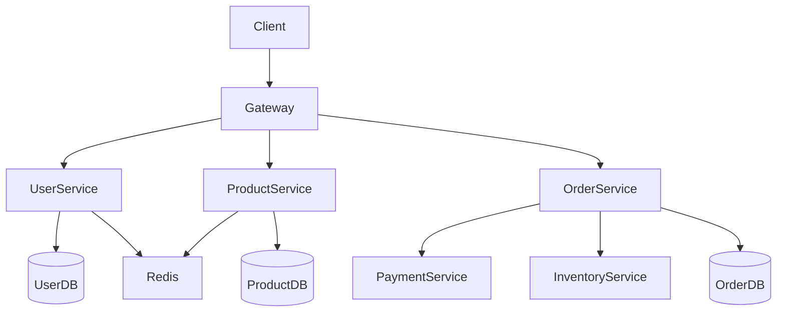

# 6. System Design and Architecture Planning

## Why System Design Matters

```
Good system design → Easy to develop, maintain, scale
Poor system design → Technical debt, frequent rewrites, constant incidents
```

System design is the "strategic" level of software engineering. Even if you use AI to assist with coding, poor architectural design cannot be saved by good code.

## AI's Role in System Design

### What AI Can Help With
- Explain pros/cons of various architectural patterns
- Recommend suitable tech stacks based on requirements
- Generate architecture diagrams (Mermaid, PlantUML)
- Identify potential architectural issues
- Provide solutions to common problems

### What AI Cannot Help With
- Completely understanding your business requirements
- Evaluating your organization's actual situation
- Making final technical decisions
- Predicting unknown business changes

## Common Architectural Patterns

### 1. Monolithic Architecture

```
┌─────────────────────────────┐
│                             │
│      Single Deployment Unit │
│  ┌─────────────────────┐   │
│  │  Web UI │ API │ DB │   │
│  └─────────────────────┘   │
│                             │
└─────────────────────────────┘

Use cases: Small projects, prototypes, MVP
Pros: Simple, easy deployment, easy testing
Cons: Difficult to scale, tech stack lock-in, limited team collaboration
```

### 2. Layered Architecture

```
┌─────────────────────────┐
│      Presentation       │  Presentation Layer
├─────────────────────────┤
│      Application        │  Application Layer
├─────────────────────────┤
│       Domain            │  Domain Layer
├─────────────────────────┤
│      Infrastructure     │  Infrastructure Layer
└─────────────────────────┘

Use cases: Enterprise applications, business systems
Pros: Clear responsibilities, easy testing, maintainable
Cons: Too many layers may affect performance
```

### 3. Microservices Architecture

```
┌──────┐  ┌──────┐  ┌──────┐
│ Auth │  │Order │  │User  │
│Service│  │Service│  │Service│
└──┬───┘  └──┬───┘  └──┬───┘
   │         │         │
   ▼         ▼         ▼
┌──────┐  ┌──────┐  ┌──────┐
│ Auth  │  │Order │  │User  │
│  DB   │  │  DB  │  │  DB   │
└──────┘  └──────┘  └──────┘

Use cases: Large systems, need independent scaling
Pros: Independent deployment, tech diversity, team autonomy
Cons: High complexity, distributed system challenges
```

### 4. Event-Driven Architecture

```
┌────────┐    Event    ┌────────┐
│Producer│ ──────────→ │Consumer│
└────────┘             └────────┘
      │                     │
      ▼                     ▼
 ┌────────┐            ┌────────┐
 │ Message │            │ Message │
 │  Broker │            │  Store  │
 └────────┘            └────────┘

Use cases: Async processing, real-time systems, decoupling
Pros: High scalability, loose coupling, strong fault tolerance
Cons: Difficult debugging, complex transactions
```

## Using AI for Architecture Design

### Dialogue Example: Choosing Architecture

```
You:
We need to build an e-commerce platform, initially expecting 1000 users,
possibly growing to 100,000 users in 2 years.
Team of 5 people, limited budget currently.
Please recommend suitable architecture.

AI:
## Architecture Recommendation

### Recommended: Progressive Evolution Architecture

Phase 1 (Current - 10,000 users):
┌─────────────────────────┐
│    Monolithic app + PostgreSQL │
│    Deploy on single cloud server│
└─────────────────────────┘

Phase 2 (10,000 - 50,000 users):
┌─────────────────────────┐
│   Add caching, CDN          │
│   Database read/write split  │
└─────────────────────────┘

Phase 3 (50,000+ users):
┌─────────────────────────┐
│   Microservices split           │
│   Introduce message queue       │
│   Kubernetes deployment          │
└─────────────────────────┘

### Tech Stack Recommendations
- Backend: Node.js/Python (fast development)
- Database: PostgreSQL (relational, good scalability)
- Cache: Redis
- Object storage: S3/compatible storage
```

### Dialogue Example: Generate Architecture Diagram

```
You:
Please generate an e-commerce system architecture diagram in Mermaid format, including:
- User service
- Product service
- Order service
- Payment service
- Inventory service
- Database
- Redis cache

AI:

```

## Architecture Decision Records (ADR)

Every important architectural decision should be documented:

```
## ADR-001: Choose PostgreSQL as Main Database

### Status: Accepted

### Context
Need a reliable relational database, supporting complex queries and transactions.

### Decision
Choose PostgreSQL 14+

### Rationale
1. Complete ACID support
2. Strong JSON support (scalability)
3. Excellent performance
4. Rich index types
5. Active community

### Consequences
Positive:
- Data integrity guaranteed
- Flexible queries

Negative:
- Requires DBA knowledge
- Horizontal scaling relatively complex
```

Have AI help you generate ADR templates:

```
You:
Please help me generate an Architecture Decision Record (ADR) template

AI:
## ADR-XXX: [Title]

Status: [Proposed/Accepted/Deprecated/Superseded]

Context
-
-

Decision
-
-

Rationale
1.
2.
3.

Consequences
Positive:
-
-

Negative:
-
-

Alternatives
1.
2.
```

## Identifying Architectural Risks

During the design phase, have AI help identify potential issues:

```
You:
What potential issues does this architecture design have?
Architecture:
- Monolithic app + PostgreSQL
- Redis cache
- File storage on server locally

AI:
## Potential Risk Analysis

### High Risk
1. Single point of failure - Local file storage lost when server crashes
   → Recommendation: Migrate to object storage (S3)

2. Cache penetration - When Redis unavailable, many requests hit DB
   → Recommendation: Implement cache degradation strategy

### Medium Risk
3. Database connection exhaustion - Possible under high concurrency
   → Recommendation: Connection pool + rate limiting

4. Scaling limitations - Monolithic architecture hard to independently scale single modules
   → Recommendation: Modular design, prepare for future splitting
```

## Practice Exercise

Perform an AI-assisted architecture assessment for your current project:

```
1. Describe your system requirements and current architecture to AI
2. Have AI list potential architectural issues
3. Have AI recommend improvement plans
4. Evaluate pros/cons of each plan
5. Choose suitable plan and generate architecture diagram
```

Remember: **AI provides the starting point; real decisions still need to be made by you.**
