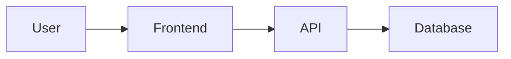
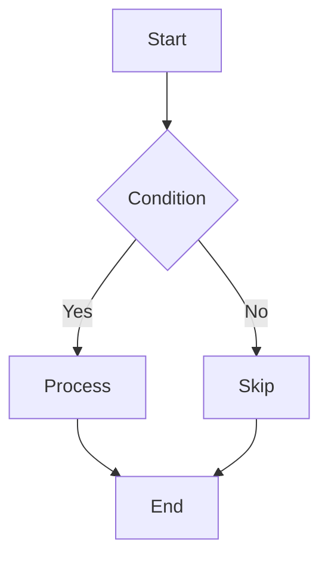

# 42. Reading and Writing Technical Articles

## Methods for Reading Technical Articles

```
┌─────────────────────────────────────────────────────────┐
│                   Reading Technical Articles                  │
├─────────────────────────────────────────────────────────┤
│                                                         │
│   Purposeful Reading                                     │
│   └─ First determine what problem to solve              │
│                                                         │
│   Critical Thinking                                      │
│   └─ Don't blindly believe everything                   │
│                                                         │
│   Experimental Verification                               │
│   └─ Run code samples yourself                         │
│                                                         │
│   Summarize and Output                                    │
│   └─ Rephrase in your own words                        │
│                                                         │
└─────────────────────────────────────────────────────────┘
```

## AI-Assisted Reading

### Reading Papers and Documentation

```
You:
How do I efficiently read English technical documentation?

AI:
## Technical Documentation Reading Tips

### 1. Scanning Method
```
Step 1: Scan titles, abstracts, conclusions
Step 2: Read headings and summaries
Step 3: Skip code examples
Step 4: Find key concepts
```

### 2. AI-Assisted Translation
```
Use AI to translate unfamiliar passages:

"Please translate this passage and explain key technical terms"

[Original text]
[AI translation + term explanations]
```

### 3. Active Questioning
```
Ask questions while reading:
- What problem is the author trying to solve?
- What is the core solution?
- What are the limitations?
- Where can I apply this?
```

### 4. Taking Notes
```
Take notes while reading:
- Words you don't know
- Core concepts
- Code snippets
- Your understanding
```

### 5. Rephrase and Verify
```
After reading a section:
Explain it to AI in your own words
Let AI evaluate if your understanding is correct
```

## Writing Skills

### 1. Structured Writing

```
You:
How do I write a good technical blog?

AI:
## Technical Blog Structure

### 1. Opening: Hook the Reader
```markdown
# Compelling Opening

**Scenario**: Have you ever encountered...

**Problem**: This article will help you solve...

**Preview**: After reading, you'll learn...
```

### 2. Body: Progressive Depth
```markdown
## 1. Background Introduction
- Problem background
- Existing solutions
- Their shortcomings

## 2. Core Concepts
- Key definitions
- Principles explained
- Code examples

## 3. Practical Application
- Specific steps
- Complete examples
- Notes and cautions

## 4. Summary
- Key points
- Use cases
- Further reading
```

### 3. Closing: Encourage Interaction
```markdown
## Summary

### Key Points
1. Point 1
2. Point 2
3. Point 3

### Further Reading
- [Link 1]
- [Link 2]

### Discussion Questions
- Have you encountered similar problems?
- What different solutions do you have?

### Comments Welcome
Feel free to share your thoughts in the comments!
```

### 2. Code Presentation Techniques

```
Good code presentation:

```javascript
// Clear comments
// ❌ Bad: Do something
// ✅ Good: Get user information by user ID

// Appropriate naming
// ❌ Bad: arr.map(x => x * 2)
// ✅ Good: numbers.map(number => number * 2)

// Progressive presentation
// Step 1: Simple version
// Step 2: Add features
// Step 3: Optimize and refactor
```
```

### 3. Visual Elements

```markdown
## Architecture Diagram
[Use Mermaid to draw]



## Flowchart


## Comparison Table
| Approach | Pros | Cons |
|------|------|------|
| A | ... | ... |
| B | ... | ... |
```

## AI-Assisted Writing

### Using AI to Assist Creation

```
You:
Please help me write a technical blog about React Hooks:

AI:
## Technical Blog Draft

# Complete Guide to React Hooks: From Beginner to Pro

## Introduction
React Hooks were introduced in React 16.8...

## What are Hooks?
Hooks let you use state and other React features in function components...

### Basic Hooks
...

### Advanced Hooks
...

## Practical Examples
...

## Common Questions
...

## Summary
...
```

### AI Polishing

```
You:
Please help me polish this technical text:

[Original text]

AI:
## Polished Version

[Improved text]

### Main Improvements:
1. Structural adjustment
2. Consistent terminology
3. Clearer logic
```

### AI Translation

```
You:
Please help me translate this English passage to Chinese:

[English original]

AI:
## Translation

[Chinese translation]

### Term Glossary
| English | Chinese |
|------|------|
| term | 术语 |
```

## Types of Technical Documents

```
1. Tutorial
   - Step-by-step teaching
   - Start from scratch
   - Hands-on guidance

2. Explanation
   - Concept explanation
   - Analysis and discussion
   - Deepen understanding

3. Reference
   - API documentation
   - Command reference
   - Quick lookup

4. Guide
   - Best practices
   - Decision guidance
   - Experience sharing
```

## Building Writing Habits

### 1. Small Steps, Quick Progress

```
Don't wait until you "have time":
- Write 100 words daily
- Write a short article weekly
- Accumulate into complete articles
```

### 2. Done is Better than Perfect

```
Drafting phase:
- Get ideas out first
- Don't pursue perfection
- Iterate and improve later

Revision phase:
- Check logic
- Optimize expression
- Add diagrams
```

### 3. Writing Triggers

```
When should you write:
- Solved a new problem
- Learned a new technology
- Hit a new pitfall
- Had a new idea
```

## Publishing Platforms

```
Personal Blog
├─ Hexo
├─ Hugo
├─ Gatsby
└─ Next.js

Tech Platforms
├─ Medium
├─ Dev.to
├─ Zhihu
└─ SegmentFault

Open Source Docs
├─ GitHub Pages
└─ Read the Docs
```

## Hands-On Exercises

```
1. Choose a technology topic you recently learned
2. Use AI to help organize your thoughts
3. Write a 500-word technical note
4. Add code examples and diagrams
5. Polish and revise
6. Publish to a platform
7. Collect feedback and improve
```

**Writing is an extension of thinking. Through writing, you can understand technology more deeply and help others grow.**

(End of file - total 359 lines)
