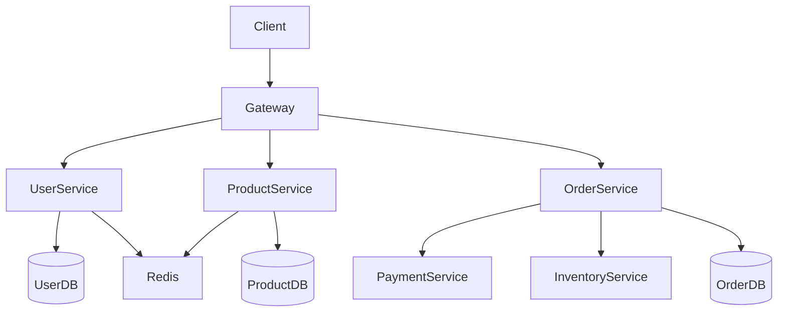

# 6. 系統設計與架構規劃

## 為什麼系統設計重要

```
好的系統設計 → 容易開發、維護、擴展
糟糕的系統設計 → 技術債務、頻繁重寫、事故不斷
```

系統設計是軟體工程的「戰略」層面。即使你用 AI 輔助寫代碼，如果架構設計有問題，再好的代碼也救不回來。

## AI 在系統設計中的角色

### AI 能幫你做
- 解釋各種架構模式的優缺點
- 根據需求推薦合適的技術棧
- 生成架構圖（Mermaid、PlantUML）
- 識別潛在的架構問題
- 提供常見問題的解決方案

### AI 不能幫你做
- 完全理解你的業務需求
- 評估組織和團隊的實際情況
- 做出最終的技術決策
- 預測未知的業務變化

## 常用架構模式

### 1. 單體架構 (Monolithic)

```
┌─────────────────────────────┐
│                             │
│      單一部署單元            │
│  ┌─────────────────────┐   │
│  │  Web UI │ API │ DB  │   │
│  └─────────────────────┘   │
│                             │
└─────────────────────────────┘

適用場景：小型項目、原型、MVP
優點：簡單、部署容易、測試方便
缺點：擴展困難、技術棧綁定、團隊協作受限
```

### 2. 分層架構 (Layered)

```
┌─────────────────────────┐
│      Presentation       │  展示層
├─────────────────────────┤
│      Application        │  應用層
├─────────────────────────┤
│       Domain            │  領域層
├─────────────────────────┤
│      Infrastructure     │  基礎設施層
└─────────────────────────┘

適用場景：企業級應用、業務系統
優點：職責分離、容易測試、維護性好
缺點：層級過多可能影響性能
```

### 3. 微服務架構 (Microservices)

```
┌──────┐  ┌──────┐  ┌──────┐
│ Auth │  │ Order│  │ User │
│ Service│ │Service│ │Service│
└──┬───┘  └──┬───┘  └──┬───┘
   │         │         │
   ▼         ▼         ▼
┌──────┐  ┌──────┐  ┌──────┐
│ Auth  │  │ Order│  │ User  │
│  DB   │  │  DB  │  │  DB   │
└──────┘  └──────┘  └──────┘

適用場景：大型系統、需要獨立擴展
優點：獨立部署、技術多樣性、團隊自治
缺點：複雜度高、分布式系統挑戰
```

### 4. 事件驅動架構 (Event-Driven)

```
┌────────┐    Event    ┌────────┐
│Producer│ ──────────→ │Consumer│
└────────┘             └────────┘
      │                     │
      ▼                     ▼
 ┌────────┐            ┌────────┐
 │ Message │            │ Message │
 │  Broker │            │  Store  │
 └────────┘            └────────┘

適用場景：異步處理、實時系統、解耦
優點：高擴展、低耦合、容錯性強
缺點：調試困難、事務複雜
```

## 使用 AI 進行架構設計

### 對話範例：選擇架構

```
你：
我们需要构建一个电商平台，初期预计 1000 用户，
未来 2 年可能增长到 10 万用户。
团队 5 人，目前预算有限。
请推荐合适的架构方案。

AI：
## 架构推荐

### 推荐方案：渐进式演进架构

Phase 1 (当前 - 1万用户)：
┌─────────────────────────┐
│    单体应用 + PostgreSQL │
│    部署在单一云服务器     │
└─────────────────────────┘

Phase 2 (1万 - 5万用户)：
┌─────────────────────────┐
│   引入缓存、CDN          │
│   数据库读写分离          │
└─────────────────────────┘

Phase 3 (5万+ 用户)：
┌─────────────────────────┐
│   微服务拆分             │
│   引入消息队列           │
│   Kubernetes 部署       │
└─────────────────────────┘

### 技术选型建议
- 后端：Node.js/Python (快速开发)
- 数据库：PostgreSQL (关系型，扩展性好)
- 缓存：Redis
- 对象存储：S3/兼容存储
```

### 對話範例：生成架構圖

```
你：
请用 Mermaid 格式生成电商系统的架构图，包含：
- 用户服务
- 商品服务
- 订单服务
- 支付服务
- 库存服务
- 数据库
- Redis 缓存

AI：

```

## 架構決策記錄 (ADR)

每次重要的架構決策都應該記錄下來：

```
## ADR-001: 选择 PostgreSQL 作为主数据库

### 状态：已接受

### 背景
需要一个可靠的关系型数据库，支持复杂查询和事务。

### 决策
选择 PostgreSQL 14+

### 理由
1. 完整的 ACID 支持
2. 强大的 JSON 支持（可扩展性）
3. 优秀的性能
4. 丰富的索引类型
5. 活跃的社区

### 后果
正面：
- 数据完整性有保障
- 查询灵活

负面：
- 需要 DBA 知识
- 水平扩展相对复杂
```

讓 AI 幫你生成 ADR 模板：

```
你：
请帮我生成架构决策记录 (ADR) 的模板

AI：
## ADR-XXX: [标题]

状态：[提议中/已接受/已废弃/已替代]

背景
-
-

决策
-
-

理由
1.
2.
3.

后果
正面：
-
-

负面：
-
-

备选方案
1.
2.
```

## 識別架構風險

在設計階段，讓 AI 幫你識別潛在問題：

```
你：
这个架构设计有什么潜在问题？
架构：
- 单体应用 + PostgreSQL
- Redis 缓存
- 文件存储在服务器本地

AI：
## 潜在风险分析

### 高风险
1. 单点故障 - 本地文件存储在服务器宕机时丢失
   → 建议：迁移到对象存储（S3）

2. 缓存穿透 - Redis 不可用时大量请求打到 DB
   → 建议：实现缓存降级策略

### 中风险
3. 数据库连接耗尽 - 高并发时可能
   → 建议：连接池 + 限流

4. 扩展限制 - 单体架构难以独立扩展单个模块
   → 建议：模块化设计，为未来拆分做准备
```

## 實踐練習

為你手邊的專案做一次 AI 輔助架構評估：

```
1. 向 AI 描述你的系统需求和当前架构
2. 让 AI 列出潜在的架构问题
3. 让 AI 推荐改进方案
4. 评估每个方案的利弊
5. 选择合适的方案并生成架构图
```

記住：**AI 提供的是起點，真正的決策仍然需要你來做。**
