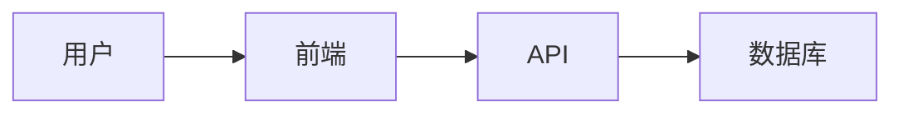
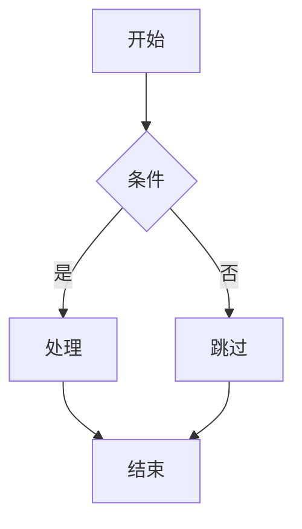

# 42. 技術文章的閱讀與寫作

## 閱讀技術文章的方法

```
┌─────────────────────────────────────────────────────────┐
│                   阅读技术文章                          │
├─────────────────────────────────────────────────────────┤
│                                                         │
│   目的性閱讀                                            │
│   └─ 先确定要解决什么问题                              │
│                                                         │
│   批判性思考                                            │
│   └─ 不要盲目相信所有内容                              │
│                                                         │
│   實驗驗證                                              │
│   └─ 代码要亲自跑一遍                                  │
│                                                         │
│   總結輸出                                              │
│   └─ 用自己的话复述                                    │
│                                                         │
└─────────────────────────────────────────────────────────┘
```

## AI 輔助閱讀

### 閱讀論文和文檔

```
你：
如何高效阅读英文技术文档？

AI：
## 技术文档阅读技巧

### 1. 扫描法
```
第一步：扫读标题、摘要、结论
第二步：看标题和小结
第三步：跳过代码示例
第四步：找到关键概念
```

### 2. AI 辅助翻译
```
使用 AI 翻译不熟悉的段落：

「请翻译这段话，并解释关键技术术语」

[原文]
[AI 翻译 + 术语解释]
```

### 3. 主动提问
```
阅读时不断提问：
- 作者想解决什么问题？
- 核心方案是什么？
- 有什么局限性？
- 我能用在什么地方？
```

### 4. 做笔记
```
边读边记：
- 不认识的词
- 核心概念
- 代码片段
- 个人理解
```

### 5. 复述验证
```
读完一段后：
用自己的话解释给 AI 听
让 AI 评价理解是否正确
```

## 寫作技巧

### 1. 結構化寫作

```
你：
如何写好技术博客？

AI：
## 技术博客结构

### 1. 开头：吸引读者
```markdown
# 引人入胜的开头

**场景**：你是否遇到过...

**问题**：本文将帮你解决...

**预告**：读完这篇文章，你将学会...
```

### 2. 正文：层层递进
```markdown
## 1. 背景介绍
- 问题背景
- 现有方案
- 它们的不足

## 2. 核心概念
- 关键定义
- 原理说明
- 代码示例

## 3. 实践应用
- 具体步骤
- 完整示例
- 注意事项

## 4. 总结
- 关键要点
- 适用场景
- 延伸阅读
```

### 3. 结尾：引导互动
```markdown
## 总结

### 关键要点
1. 要点 1
2. 要点 2
3. 要点 3

### 延伸阅读
- [链接 1]
- [链接 2]

### 思考题
- 你遇到过类似的问题吗？
- 有什么不同的解决方案？

### 欢迎讨论
欢迎在评论区分享你的想法！
```

### 2. コード展示技巧

```
好的代码展示：

```javascript
// 清晰的注释
// ❌ 不好：做某事
// ✅ 好：根据用户 ID 获取用户信息

// 适当的命名
// ❌ 不好：arr.map(x => x * 2)
// ✅ 好：numbers.map(number => number * 2)

// 渐进式展示
// 第一步：简单版本
// 第二步：增加功能
// 第三步：优化重构
```

### 3. 圖文並茂

```markdown
## 架构图
[使用 Mermaid 绘制]



## 流程图


## 表格对比
| 方案 | 优点 | 缺点 |
|------|------|------|
| A | ... | ... |
| B | ... | ... |
```

## AI 輔助寫作

### 用 AI 輔助創作

```
你：
请帮我写一篇关于 React Hooks 的技术博客：

AI：
## 技术博客草稿

# React Hooks 完全指南：从入门到精通

## 前言
React Hooks 是 React 16.8 引入的新特性...

## 什么是 Hooks？
Hooks 让你能够在函数组件中使用状态和其他 React 特性...

### 基础 Hooks
...

### 高级 Hooks
...

## 实战示例
...

## 常见问题
...

## 总结
...
```

### AI 潤色

```
你：
请帮我润色这段技术文字：

[原文]

AI：
## 润色后的版本

[优化后的文字]

### 主要改进：
1. 结构调整
2. 术语统一
3. 逻辑更清晰
```

### AI 翻譯

```
你：
请帮我把这段英文翻译成中文：

[英文原文]

AI：
## 翻译

[中文翻译]

### 术语对照
| 英文 | 中文 |
|------|------|
| term | 术语 |
```

## 技術文檔類型

```
1. 教程 (Tutorial)
   - 步骤式教学
   - 从零开始
   - 手把手指导

2. 解释 (Explanation)
   - 概念阐述
   - 分析讨论
   - 加深理解

3. 参考 (Reference)
   - API 文档
   - 命令参考
   - 快速查找

4. 指南 (Guide)
   - 最佳实践
   - 决策指导
   - 经验分享
```

## 建立寫作習慣

### 1. 小步快跑

```
不要等「有空」再写：
- 每天写 100 字
- 每周写一篇短文
- 积累成完整文章
```

### 2. 先完成再完美

```
草稿阶段：
- 先把想法倒出来
- 不追求完美
- 之后迭代改进

修改阶段：
- 检查逻辑
- 优化表达
- 添加图示
```

### 3. 写作触发器

```
什么时候应该写：
- 解决了新问题
- 学到了新技术
- 踩到了新坑
- 有了新想法
```

## 發表平台

```
个人博客
├─ Hexo
├─ Hugo
├─ Gatsby
└─ Next.js

技术平台
├─ Medium
├─掘金
├─ 知乎
└─ 思否

开源文档
├─ GitHub Pages
└─ Read the Docs
```

## 實踐練習

```
1. 选择一个最近学到的技术点
2. 用 AI 帮助整理思路
3. 写一篇 500 字的技术笔记
4. 添加代码示例和图示
5. 润色修改
6. 发布到平台
7. 收集反馈改进
```

**寫作是思考的延伸。通過寫作，你能更深入地理解技術，也能幫助他人成長。**
